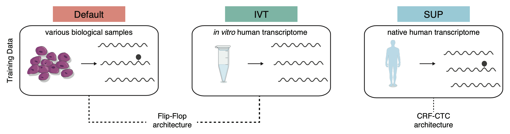

<!-- README.md is generated from README.Rmd. Please edit that file -->

```{r, include = FALSE}
knitr::opts_chunk$set(
  collapse = TRUE,
  comment = "#>"
)
```



# basecalling_models

<!-- badges: start -->
<!-- badges: end -->

We benchmarked the ability of novel base calling models to detect RNA modifications from native RNA reads generated on the Oxford Nanopore Technologies platform.
The tested base calling models are listed below:

* rna_r9.4.1_70bps_hac (default)
* rna_r9.4.1_70bps_ivt_hac (ivt)
* rna_r9.4.1_70bps_sup (sup)

All files required to run guppy with these models can be downloaded from [OSF](https://osf.io/2xgkp/). 
