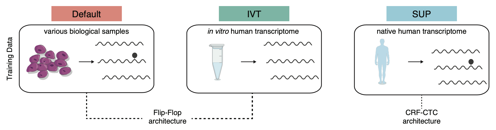

<!-- README.md is generated from README.Rmd. Please edit that file -->



# <nobr> Basecalling Models for enhanced RNA modification detection <nobr>

<!-- badges: start -->
<!-- badges: end -->

## Table of Contents

- [General](#General)
- [How to use these models?](#How%20to%20use%20these%20models?)
  - [Standalone](#Create-new-annotation-files)
  - [Master of Pores](#Map-reads-to-cytoplasmic-ribosomal-RNA-sequences)
- [Citation](#Citation)

## General

We benchmarked the ability of novel base calling models to detect RNA
modifications from native RNA reads generated on the Oxford Nanopore
Technologies platform. The tested base calling models are listed below:

| <nobr> Model (short) |   <nobr> Model (long)    | <nobr> Software used for training |                                       <nobr> Training data                                       | <nobr>Model type | <nobr> Model size (MB) | <nobr> Median accuracy (human) | <nobr> Distribution | <nobr> Basecaller Support |
|:--------------------:|:------------------------:|:---------------------------------:|:------------------------------------------------------------------------------------------------:|:----------------:|:----------------------:|:------------------------------:|:-------------------:|:-------------------------:|
|       default        |   rna_r9.4.1_70bps_hac   |              tayaki               |                                          not disclosed                                           |    flip-flop     |          1.99          |              91%               |    guppy v6.0.6     |    all guppy versions     |
|         IVT          | rna_r9.4.1_70bps_ivt_hac |              tayaki               | [Nanopore-WGS-Consortium](https://github.com/nanopore-wgs-consortium/NA12878/blob/master/RNA.md) |    flip-flop     |          1.99          |              88%               |     *this work*     |    all guppy versions     |
|         SUP          |   rna_r9.4.1_70bps_sup   |              bonito               |                 [PRJEB40872](https://www.ebi.ac.uk/ena/browser/view/PRJEB40872)                  |     CRF-CTC      |           27           |              97%               |     *this work*     | guppy v6.0.6 and upwards  |

All files required to run guppy (v6.0.6) with these models can be
downloaded from [OSF](https://osf.io/2xgkp/). Code required to reproduce
published results can be found in `/scripts`

## How to use these models?

### Standalone

When using guppy standalone make sure version 6.0.6 or higher is
installed on your system. Next, download the files of each model from
[OSF](https://osf.io/2xgkp/). This should include three files per model:

``` bash
rna_r9.4.1_70bps_<model>.cfg
rna_r9.4.1_70bps_<model>.cfg~ 
template_rna_r9.4.1_70bps_<model>.jsn
```

Make sure to place these files in the following folder within guppy

``` bash
~/ont-guppy_<version>/data/
```

In order to run them use the `-c [ --config ] arg` flag and specify the
desired config file

``` bash
guppy_basecaller –i ./fast5 –s ./guppy_out –c -c rna_r9.4.1_70bps_<model>.cfg --num_callers 2 --cpu_threads_per_caller 1
```

### Master of Pores

For use within the MasterofPores nextflow pipleline download the files
specified above into the `mop_preprocess` module as follows:

``` bash
~/MOP3/mop_preprocess/bin/ont-guppy_<version>/data/
```

specify them in the appropriate config file (either
`drna_tool_splice_guppy6_opt.tsv` or
`drna_tool_unsplice_guppy6_opt.tsv`) found in
`~/mop_preprocess/tools_opts`. An example file is shown below:

``` bash

#step   tool    extrapars
demultiplexing  deeplexicon     ""
demultiplexing  guppy   ""
filtering       nanofilt        ""
basecalling     guppy   "-c rna_r9.4.1_70bps_<model>.cfg --disable_qscore_filtering"
filtering       nanoq   ""
mapping graphmap        ""
mapping graphmap2       "-x rnaseq"
mapping minimap2        "-uf -ax splice -k14"
mapping bwa     ""
counting        htseq   "-a 0"
counting        nanocount       ""
discovery       bambu   ""
```

Running mop_preprocess from there as specified in the pipelines
[documentation](https://biocorecrg.github.io/MOP2/docs/about.html) will
use the provided basecalling model.

## Citation

If you find this work useful, please cite:

Diensthuber G\*, Pryszcz L\*, Delgado-Tejedor A, Llovera L., Lucas MC.,
Begik 0. and Novoa EM.: Enhanced detection of RNA modifications with
high-accuracy nanopore RNA basecalling models. bioRXiv 2023.
<doi:%5BTBA%5D>.
